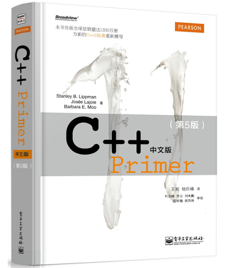

# 《C++ Primer中文版（第5版）》笔记

## 目录

第1章 开始

### 第I部分 C++基础

第2章 变量和基本类型

第3章 字符串、向量和数组

第4章 表达式

第5章 语句

第6章 函数

[第7章 类](Notes/Chapter-7 Classes.md)

### 第II部分 C++标准库

第8章 IO库

第9章 顺序容器

第10章 泛型算法

第11章 关联容器

第12章 动态内存

### 第III部分 类设计者的工具

[第13章 拷贝控制](Notes/Chapter-13 Copy Control.md)

第14章 操作重载与类型转换

[第15章 面向对象程序设计](Notes/Chapter-15 Object-Oriented Programming.md)

第16章 模板与泛型编程

### 第IV部分 高级主题

第17章 标准库特殊设施

第18章 用于大型程序的工具

第19章 特殊工具与技术

## 关于

本项目基于【Cpp-Primer-5th-Notes-CN]】https://github.com/czs108/Cpp-Primer-5th-Notes-CN，在该笔记基础上，结合个人看书理解，增添删改部分内容。

***E-Mail***：295326665@qq.com

